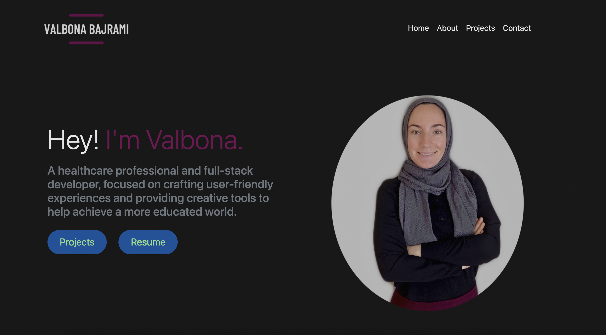
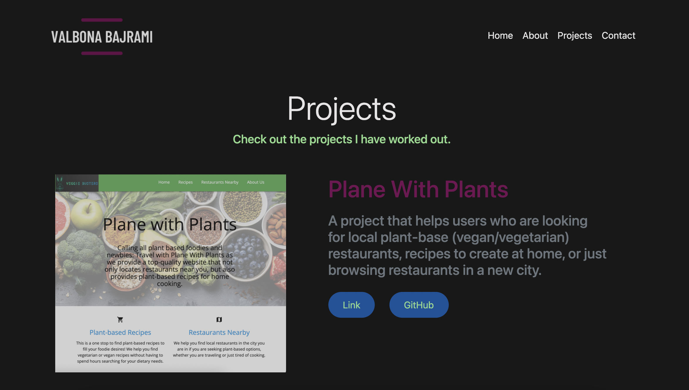

# Portfolio  <br/>


## Description
A portfolio that displays information about me, the projects I have done through the coding bootcam course, as well as ways to contact me. Here is the link to the deployed portfolio 

## Table of Contents 

* [User Story](#userstory)
* [Screenshots](#screenshots)
* [Tech](#tech)
* [License](#license)
* [Contributors](#contributors)
* [Questions](#questions)

## User Story
```
AS AN employer
I WANT to view a potential employee's deployed portfolio of work samples
SO THAT I can review samples of their work and assess whether they're a good candidate for an open position
```

## Screenshots
 <br/> <br/>


## Tech
* HTML
* CSS 
* Bootstrap
## Contributors
:woman_with_headscarf: [Valbona Bajrami](https://github.com/valbona1992)

## License
License is [MIT](https://opensource.org/licenses/MIT) standard license.

## Questions
GitHub: https://github.com/valbona1992  <br/>
Email me with any questions: valbona12@gmail.com
