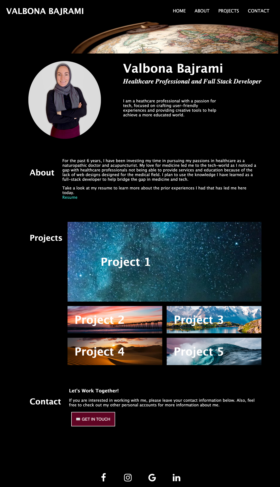

# homework2-ProfessionalPortfolio

To view the actual webpage, please click [here](https://valbona1992.github.io/homework2-ProfessionalPortfolio/).

## Summary
This assignment required me to deploy a portfolio website from scratch using HTML and CSS. 

Below is a summary of what I implemented. 

* Added a navigation bar that included my name, and links to the following: about, work, and contact. 
* Added a header photo. 
* Added a personal photo with a short description about me. 
* Added sections that included information regarding the links above (about, work and contact). 
* In the work section, I included flexbox to help organize the listed projects as described in the acceptance criteria. 
* Added contact information, as well as included social media buttons in the footer (with placeholders).

## Screenshot

